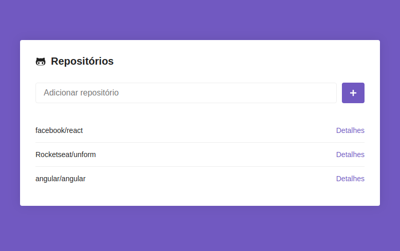
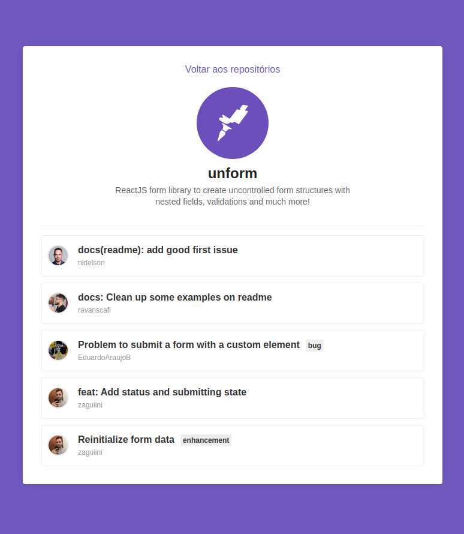

<h1 align="center">
    
</h1>

<h3 align="center">
  Desafio 5: Primeiro projeto com ReactJS
</h3>

<blockquote align="center">“Para quem fica melhor a cada dia, ficar pronto é utopia!”</blockquote>

<p align="center">
  

  

  <a href="https://github.com/alleycarvalho/bootcamp-gostack-desafio-05/stargazers">
    
  </a>
</p>

## :rocket: Sobre o projeto

- Uma aplicação criada do zero utilizando [react-app](https://create-react-app.dev/docs/getting-started).

- A aplicação permite adicionar **reposítórios do Github** em uma lista gravada no **LocalStorage** do navegador.

- Cada repositório pode ser visto em **Detalhes** na página específica.

## :mortar_board: Bootcamp - Desafio 5

### Funcionalidades

###### 1. Captando erros

- [x] Adicionar um `try/catch` na função `handleSubmit` do componente `Main` e caso um repositório não seja encontrado na **API do Github**, adicionar uma borda vermelha no input em que o usuário digitou o nome do repositório.

###### 2. Repositório duplicado

- [x] Adicionar na função `handleSubmit`, uma verificação para ver se o repositório não está duplicado, ou seja, se ele ainda não existe no estado de `repositories`.

- [x] Caso exista, dispare um erro, e com isso o código cairá no `catch` do `try/catch` criado na funcionalidade anterior.

###### 3. Filtro de estado

- [x] Adicionar um **filtro de estado** na listagem de **issues** que criamos nos **detalhes do repositório**. O estado representa se a issue está **em aberto**, **fechada** ou uma opção para **exibir todas**.

Exemplos de requisição:

```
https://api.github.com/repos/rocketseat/unform/issues?state=all
https://api.github.com/repos/rocketseat/unform/issues?state=open
https://api.github.com/repos/rocketseat/unform/issues?state=closed
```

###### 4. Paginação

- [ ] Adicionar paginação nas **issues** listadas nos **detalhes do repositório**. A API do Github lista no máximo 30 issues por página e você pode controlar o número da página atual por um parâmetro no endereço da requisição:

```
https://api.github.com/repos/rocketseat/unform/issues?page=2
```

- [ ] Adicionar apenas um botão de **próxima página** e **página anterior**.
- [ ] O botão de **página anterior** deve ficar `desativado` na primeira página.

## :computer: Resultado do desafio

### Adicionando e listando repositórios do Github



### Detalhes do repositório



## :memo: Licença

Esse projeto está sob a licença MIT. Veja o arquivo [LICENSE](LICENSE.md) para mais detalhes.

---

Desafio realizado por Alley M. Carvalho
